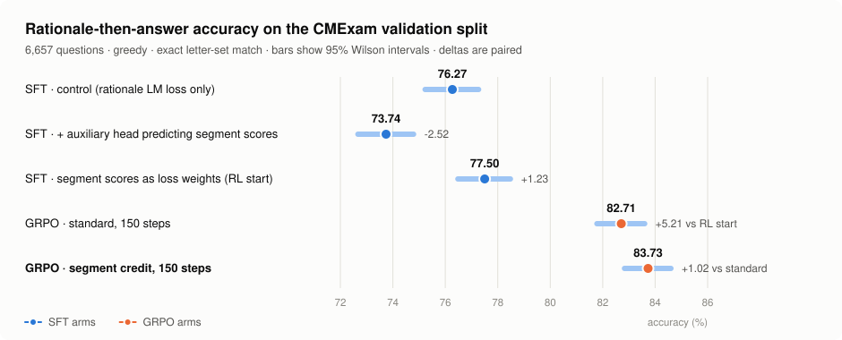
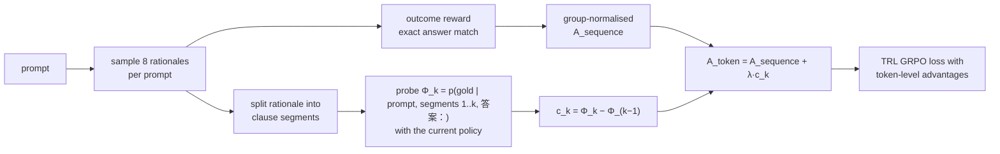
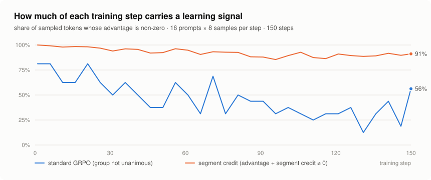
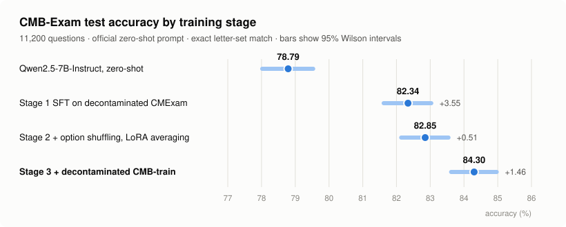
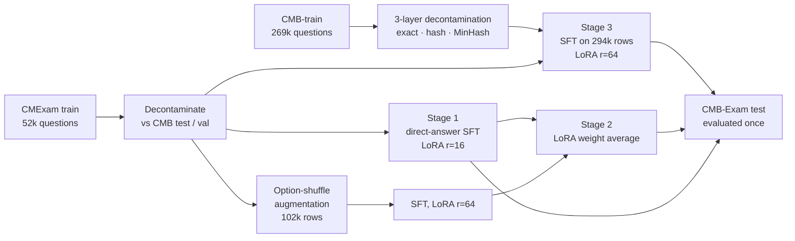
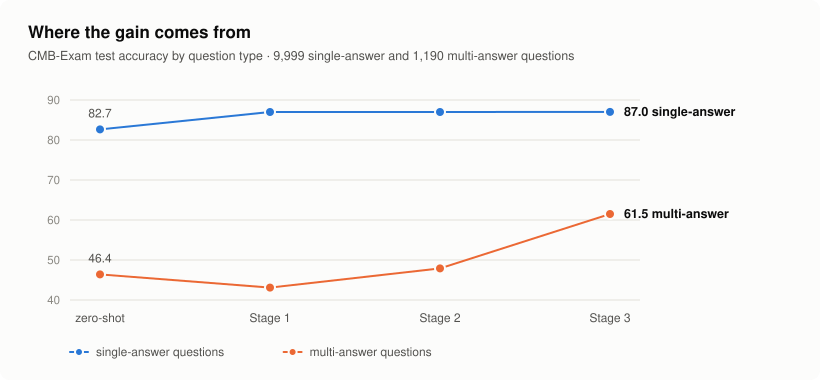
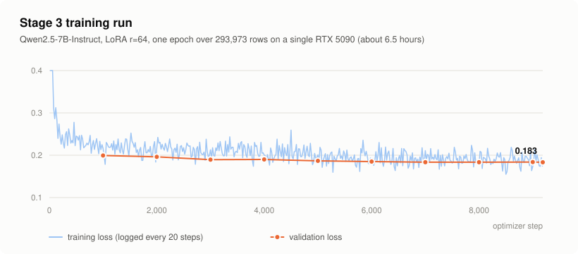
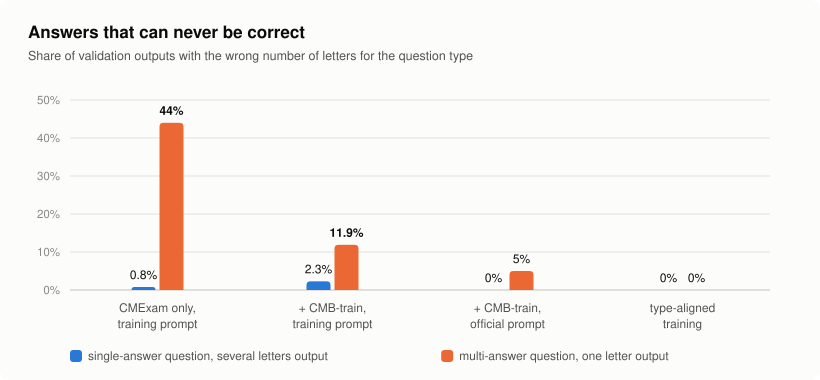
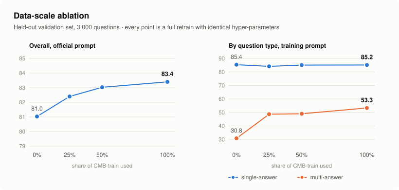

<div align="center">

# Segment-Credit GRPO

### Dense credit assignment from the policy's own confidence

**Qwen2.5-7B-Instruct from 78.8 to 84.3 on CMB-Exam on one consumer GPU, and a GRPO variant that assigns credit inside a rationale from the policy's own confidence: +1.0 over standard GRPO at equal budget, with no teacher and no reward model.**

[](LICENSE)
[](requirements.txt)
[](tests)
[](#reproduce)

</div>

Two lines of work share this repository, and every number on this page is a paired comparison with a confidence interval:

- **Part I · Sparse rewards.** When a model writes a rationale and only its final answer can be checked, GRPO gives every token the same advantage and learns nothing from unanimous sampling groups. *Segment-credit GRPO* reads the policy's own belief in the correct answer after each clause of its rationale and turns the change into a per-segment advantage. Same prompts, same samples, same steps: **83.73 vs 82.71** for standard GRPO (CI +0.6 to +1.5, *p* = 8 × 10⁻⁶), with the share of tokens carrying a gradient raised from 20–60% to ~90%.
- **Part II · Supervised data.** Three SFT stages, each clearing a significance test, take the base model from **78.79 to 84.30** on the 11,200-question CMB-Exam test set: decontaminated CMExam, option-shuffle augmentation with LoRA weight averaging, and 227k decontaminated in-domain questions. The measurement layer (intervals, McNemar, minimum detectable effect, evaluation-noise bounds) says which of these gains are real, and the ablations say which data is doing the work.

---

## Part I · Segment-credit GRPO for answer-only rewards

<picture>
  <source media="(prefers-color-scheme: dark)" srcset="assets/rl_arms_dark.svg">
  
</picture>

### The problem

A rationale-then-answer completion carries one verifiable bit: the final letters. Standard GRPO spreads that bit over every token of the completion, so the sentence that nearly derailed a correct answer is rewarded with the rest, and the correct sentence inside a wrong answer is punished with the rest. Worse, a group of 8 samples that is all-right or all-wrong has zero advantage everywhere; on this task standard GRPO reaches 60–80% unanimous groups within 50 steps and most sampled tokens stop contributing.

The starting model shows how much is at stake. On 1,500 held-out questions, 173 are answered correctly when the model answers directly but wrongly after it writes a rationale, against 45 the other way round. Rationales mislead more often than they help, and an outcome reward cannot say which sentence did it.

### The idea

Multiple-choice answers are enumerable, so the policy's belief in the gold answer can be read exactly at any point of its own rationale: append the answer marker after segment *k* and take the next-token distribution over the option letters. Call the gold-letter probability Φ<sub>k</sub>, with Φ<sub>0</sub> the belief before any rationale. Segment *k* earns what it changed,

c<sub>k</sub> = Φ<sub>k</sub> − Φ<sub>k−1</sub>,

and every token in it gets **A<sub>token</sub> = A<sub>sequence</sub> + λ · c<sub>k</sub>** (λ = 2), while the answer tokens keep the ordinary group-normalised advantage. Three things follow:

1. **Credits telescope.** Σ c<sub>k</sub> = Φ<sub>K</sub> − Φ<sub>0</sub>, the net confidence the rationale added. Padding earns nothing; a segment that lowers the belief in the right answer is charged for it. This is potential-based shaping applied inside a sequence.
2. **Unanimous groups still learn.** A<sub>sequence</sub> is zero for them, c<sub>k</sub> is not: the segments that raised the belief are reinforced within completions the outcome reward could not tell apart.
3. **Nothing external.** The probe is the policy being trained. No teacher, no reward model, no process labels; one extra forward pass per segment boundary with `logits_to_keep=1`, about 14 s per step on the 7B model.



### The comparison

Both arms start from the same adapter, see the same 4,000-question pool in the same order (questions never used in the segment-scored SFT and disjoint from every evaluation set), draw 8 samples for 16 prompts per step, and train 150 steps with identical hyper-parameters and seed. The only difference is λ.

| Arm | CMExam validation, rationale mode | 95% CI | Paired difference | Output length (mean / median chars) | Answer letter in first 20 chars |
|---|---:|---|---|---:|---:|
| RL start (segment-weighted SFT) | 77.50 | 76.48 – 78.48 | | 151 / 123 | 34.8% |
| Standard GRPO | 82.71 | 81.78 – 83.60 | +5.21 vs start | 59 / 37 | 16.5% |
| **Segment-credit GRPO** | **83.73** | 82.83 – 84.60 | **+1.02 vs standard**, CI +0.59 to +1.47, *p* = 8 × 10⁻⁶ | 50 / 36 | 12.9% |

The 2×2 table between the two GRPO arms is 5,426 both right, 80 only standard, 148 only segment credit, 1,003 both wrong; at that 3.4% discordance the smallest detectable difference is 0.64 points. Negation questions gain +2.6 (*p* = 0.003) and case questions +1.3 (*p* = 0.01); the other slices move the same way without reaching significance. Against the direct-answer SFT model on the 1,500 shared questions, the rationale-mode gap shrinks from −8.5 (start) to −4.3 (standard GRPO) to −3.3 (segment credit).

<picture>
  <source media="(prefers-color-scheme: dark)" srcset="assets/rl_dynamics_dark.svg">
  
</picture>

Both arms learn to write less: rationales shrink to a third of their length, which by itself explains most of the +5 over the start, because a shorter rationale has fewer chances to mislead. Segment credit does not stop that; it changes what survives inside the short rationale. It fixes 589 of the questions the start got wrong (standard GRPO: 527) while breaking 174 (180), and its rationales announce an answer letter early *less* often, so the gain is not Φ being gamed by stating the answer up front. Early in training Φ<sub>K</sub> sits below Φ<sub>0</sub>, writing the rationale lowers the belief in the right answer; by the end the two are equal.

### Where the segment signal has to enter: an SFT counterpart

Before RL, the same question was asked of supervised training. DeepSeek V4 Pro rated 111k clause-level segments of 10k official rationales for how decisive each is (1–5; 93% within-one-point agreement on re-annotation). Three LoRA runs on the same 9,484 questions, same seed:

| Arm | How the scores enter | Rationale-mode accuracy | vs control | Direct-answer prompt, constrained scoring |
|---|---|---:|---|---:|
| control | not at all | 76.27 | | 84.28 |
| predict | auxiliary head regresses the score (Spearman 0.57 on held-out segments) | 73.74 | **−2.52**, *p* = 4 × 10⁻⁷ | 83.43 (−0.85, *p* = 8 × 10⁻⁵) |
| weighted | scores become per-token loss weights | **77.50** | **+1.23**, CI +0.53 to +1.94, *p* = 8 × 10⁻⁴ | 84.49 (+0.20, n.s.) |

The head learns to judge segments and the model that learned it answers worse, in rationale mode and in direct mode alike; the same scores placed in the generation loss help, and only in rationale mode. Segment-level information is useful when it acts on the tokens being generated, which is exactly what segment-credit GRPO does with a signal the policy provides itself. Details and the full tables: [`docs/06_segment_weighted_sft.md`](docs/06_segment_weighted_sft.md) and [`docs/05_segment_credit_grpo.md`](docs/05_segment_credit_grpo.md). The scores are released without question text in [`data/segment_scores/`](data/segment_scores).

### Limits

One seed per arm; λ fixed at 2; no sequence-level-shaping or shuffled-credit control yet (both are queued); the RL starting adapter was trained with the teacher-scored weights, so a rerun from the control adapter would remove the last external dependency. The RL procedure itself uses no external model. Both GRPO arms remain 3–4 points below the direct-answer model on this benchmark: this is a result about how to use a sparse reward, not a claim that rationales beat direct answers here.

---

## Part II · Supervised data, measured

<picture>
  <source media="(prefers-color-scheme: dark)" srcset="assets/stages_dark.svg">
  
</picture>

[CMB-Exam](https://github.com/FreedomIntelligence/CMB) is a Chinese medical licensing benchmark: 11,200 multiple-choice questions across physician, nursing, pharmacy, technician, postgraduate-entrance and specialty exams, a tenth of them with several correct options. Every number in this part comes from one evaluation of one model on the full test set, with the official CMB zero-shot prompt, greedy decoding and exact letter-set matching.

| Stage | What changes | CMB-Exam test | 95% CI | Gain vs previous | McNemar *p* |
|---|---|---:|---|---:|---:|
| – | Qwen2.5-7B-Instruct, zero-shot | 78.79 | 78.02 – 79.53 | | |
| 1 | Direct-answer SFT on decontaminated CMExam | 82.34 | 81.62 – 83.03 | +3.55 | 4 × 10⁻³¹ |
| 2 | Option-shuffle augmentation + LoRA weight averaging | 82.85 | 82.14 – 83.54 | +0.51 | 4 × 10⁻⁴ |
| 3 | + 227k decontaminated CMB-train questions | **84.30** | 83.62 – 84.97 | +1.46 | 2 × 10⁻¹⁰ |

Stage 3 is +1.96 over Stage 1 (bootstrap 95% CI +1.50 to +2.43) and +5.51 over the base model. Excluding the 250 test questions that sit in the 0.5–0.7 similarity band to any training question leaves the Stage 3 gain at +1.88, so the improvement is not leakage. Everything runs on one RTX 5090 (32 GB); the longest training run takes six and a half hours.



### Stage 1 · Direct-answer SFT on decontaminated CMExam

[CMExam](https://github.com/williamliujl/CMExam) provides 52k licensing-exam questions with official answers. Each question becomes one chat turn whose target is only the answer letters, so the loss is spent on the decision rather than on imitating explanations. Before training, every question whose normalised stem also appears in CMB-test is removed. One epoch with LoRA r=16 lifts the test score from 78.79 to 82.34.

### Stage 2 · Option-shuffle augmentation and LoRA weight averaging

A diagnostic on held-out questions showed that the Stage 1 model changes its answer on 16% of questions when the options are merely reordered. Stage 2 adds one permuted copy of every question whose options do not refer to each other (49,615 of 52,369; "all of the above"-style questions are left alone), with the answer letters remapped. The augmented model alone is not significantly better (+0.20, *p* = 0.32), but it fails on different questions. Averaging the two adapters in weight space, ΔW = ½ ΔW₁ + ½ ΔW₂, keeps the strengths of both at zero training cost: **+0.51, *p* = 4 × 10⁻⁴**. Adapters of different rank are merged exactly with PEFT's `cat` combination, and the script checks the merged update numerically against the weighted sum.

### Stage 3 · In-domain scale-up with strict decontamination

CMB ships a 269k-question training split from the same exam families as the test set, which makes contamination control the whole game. `build_cmb_train_sft.py` applies three layers against CMB-test, CMB-val and the CMExam evaluation splits (24,699 reference stems):

| Step | Rows |
|---|---:|
| CMB-train, raw | 269,359 |
| structurally invalid (duplicate options, malformed answers, …) | −787 |
| case-linked "type C" questions that need a shared stem | −134 |
| exact normalised-stem match with an evaluation question | −3,392 |
| duplicate within train (stem + option-set hash) | −34,209 |
| MinHash near-duplicate of an evaluation question (Jaccard ≥ 0.7) | −914 |
| held out as validation set | −3,000 |
| **kept** | **226,923** |

Every removed row is written to an audit file, and 1,354 borderline rows (Jaccard 0.5–0.7) are kept but logged so their effect can be measured later. One detail mattered more than expected: CMB stores four-option questions with an empty fifth option, and the official evaluator renders it as `E. `. Rejecting rows with empty option text would have silently dropped 18,694 questions, most of the postgraduate-entrance subset; keeping them rendered exactly as the evaluator does is what makes that subset improve by 9.3 points.

<picture>
  <source media="(prefers-color-scheme: dark)" srcset="assets/question_types_dark.svg">
  
</picture>

The gain is concentrated where the model was weakest. Single-answer accuracy is flat from Stage 1 to Stage 3 (87.0), while multi-answer accuracy rises from 43.1 to 61.5: CMExam contains only 3% multi-answer questions, so the Stage 1 model had learned that an answer is one letter.

<picture>
  <source media="(prefers-color-scheme: dark)" srcset="assets/training_loss_dark.svg">
  
</picture>

### Measuring what is real

A benchmark number without an error bar invites over-reading, so the evaluation layer came before the last round of experiments.

| Question | Measurement | Result |
|---|---|---|
| Is a single run deterministic? | same model, same settings, twice | 0 of 3,000 answers change |
| Does batching matter? | batch 32 vs batch 8, bf16 | 0.67% of answers change; accuracy differs by 0.07 (CI −0.17 to +0.33) |
| How small a difference can the test set detect? | paired McNemar, 80% power, n = 11,200 | 0.37 points between close models, 0.67 between independent runs |
| Does the prompt template matter? | same model, training prompt vs official CMB prompt | **+1.43** (CI +0.63 to +2.23, *p* = 5 × 10⁻⁴) |

The last row is the most useful finding of this part. The official prompt states whether a question has one or several correct answers; the training prompt did not, and the model paid for guessing.

<picture>
  <source media="(prefers-color-scheme: dark)" srcset="assets/format_errors_dark.svg">
  
</picture>

Training with the question type in the prompt removes these impossible answers entirely and is significantly better under that prompt (+0.97 on validation, *p* = 0.02). Under the official test prompt, which already supplies the type, the same model scores 84.33 against Stage 3's 84.30 (+0.03, CI −0.35 to +0.41). The recipe has reached its plateau, and the protocol is what makes that statement possible.

### What the data is doing

<picture>
  <source media="(prefers-color-scheme: dark)" srcset="assets/scale_ablation_dark.svg">
  
</picture>

Each point is a full retrain from the base model with identical hyper-parameters and nested, stratified subsets of CMB-train. More in-domain data helps monotonically, but almost all of it is the multi-answer decision rule, most of which is learned from the first quarter of the data. Single-answer accuracy does not move between 0% and 100%: those errors are knowledge the adapter does not store after one epoch, not a shortage of questions.

Two negative results belong here as well: synthetic questions and statements written by a stronger model and filtered by blind answering cost −1.4 to −2.2 points, and mixing official rationales into direct-answer training as an auxiliary task cost −1.6. Both are recorded with the same protocol as the positives.

---

## Reproduce

```bash
git clone https://github.com/ZSYZSY-111/segment-credit-grpo.git
cd segment-credit-grpo
pip install -r requirements.txt          # keep the torch build that matches your CUDA
python -m unittest discover -s tests -t . # 107 tests, no GPU or data needed
```

Datasets are not redistributed; [`data/README.md`](data/README.md) explains where to get CMExam and CMB, how to build every training file, and how to rebuild the segment-scored rows from the released scores. Then:

```bash
bash launch/stage1_sft_cmexam.sh            # ~1 h on one RTX 5090
bash launch/stage2_shuffle_soup.sh          # ~2 h training, averaging runs on CPU
bash launch/stage3_cmb_train.sh             # ~6.5 h
bash launch/evaluate_cmb.sh <adapter> <name> [reference-predictions.json]
bash launch/stage4_segment_weighted_sft.sh  # three rationale-SFT arms, ~1 h each + evaluation
bash launch/stage5_segment_credit_grpo.sh   # standard GRPO ~2 h, segment credit ~3 h, evaluation ~20 min each
```

Software used for the reported numbers: torch 2.8.0 (CUDA 12.8), transformers 5.13.1, peft 0.19.1, trl 1.8.0, datasets 5.0.0. Hyper-parameters for every reported run are in [`configs/`](configs).

## Repository layout

```
scripts/     data builders, trainers (SFT, segment-weighted SFT, GRPO with segment credit), evaluators, analysis
launch/      one shell script per stage, with the exact hyper-parameters
configs/     the recorded arguments of every reported run
results/     every number on this page as JSON, including training curves
assets/      figures, rendered by tools/make_figures.py from results/
docs/        method notes: data pipeline, training recipe, evaluation protocol, analysis, segment credit, segment weighting
data/        dataset instructions and the released segment scores (no question text)
tests/       unit tests for all data, reward, credit-assignment and scoring code
```

| Script | Purpose |
|---|---|
| `grpo_segment_credit.py`, `train_grpo.py`, `grpo_rewards.py` | segment-credit GRPO on top of TRL: probes, credits, token-level advantages, verifiable rewards |
| `sentence_split.py` | clause-level segmentation shared by scoring, weighting and credit assignment |
| `train_sft_score_head.py`, `build_sentence_score_sft.py` | rationale SFT with segment scores as loss weights or as an auxiliary prediction target |
| `synth_harness/` | annotation and synthesis harness: request cache, budget, hard refusal of evaluation stems, provenance |
| `build_cot_rl_pool.py`, `compare_headroom_records.py` | RL prompt pool disjoint from the scored SFT; paired 2×2 comparison of per-question records |
| `build_cmexam_direct_sft.py`, `build_cmexam_rationale_sft.py`, `decontaminate_cmexam_against_cmb.py` | Stage 1 and rationale-style data |
| `build_shuffle_aug.py`, `merge_lora_soup.py` | Stage 2 augmentation and weight averaging |
| `build_cmb_train_sft.py` | Stage 3 data with three-layer decontamination and audit files |
| `train_sft.py` | LoRA SFT with completion-only loss |
| `eval_cmb.py`, `score_cmb.py` | official-prompt evaluation and paired comparison |
| `score_predictions.py` | Wilson and bootstrap intervals, exact McNemar, minimum detectable effect |
| `eval_validation.py` | validation accuracy in direct or rationale mode, permutation consistency, optional type hint |
| `build_ablation_sets.py`, `make_internal_val_cmb_json.py` | nested ablation subsets; validation split in the official CMB format |

## Limitations

- Multiple-choice accuracy only. Nothing here measures clinical reasoning or free-text answers, and the model must not be used for medical decisions.
- One seed per configuration. The evaluation-noise measurements bound the noise of evaluation, not of training.
- The CMB validation set is a held-out split of CMB-train, so it shares the test distribution more closely than an independent set would; the RL and segment-weighting results are on the CMExam validation split and have not been evaluated on CMB-test.

## Acknowledgements

Built on [Qwen2.5](https://github.com/QwenLM/Qwen2.5), [CMB](https://github.com/FreedomIntelligence/CMB), [CMExam](https://github.com/williamliujl/CMExam), [PEFT](https://github.com/huggingface/peft) and [TRL](https://github.com/huggingface/trl). Segment scores were produced with DeepSeek V4 Pro. Released under the MIT License; the datasets keep their own licences.
