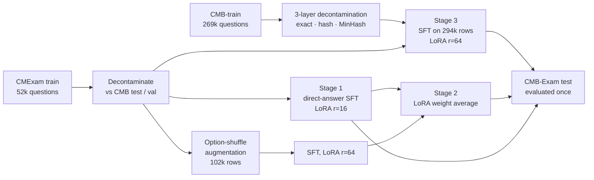

<div align="center">

# Chinese Medical Exam LLM

**Qwen2.5-7B-Instruct from 78.8 to 84.3 on CMB-Exam, on a single consumer GPU, with no teacher model and an evaluation protocol that says how much of each gain is real.**

[](LICENSE)
[](requirements.txt)
[](tests)
[](#reproduce)

</div>

<picture>
  <source media="(prefers-color-scheme: dark)" srcset="assets/stages_dark.svg">
  
</picture>

Gains next to each interval are measured against the previous stage. Every number on this page comes from one evaluation of one model on the full 11,200-question test set, with the official CMB zero-shot prompt, greedy decoding and exact letter-set matching.

## What this project is

[CMB-Exam](https://github.com/FreedomIntelligence/CMB) is a Chinese medical licensing benchmark: 11,200 multiple-choice questions across physician, nursing, pharmacy, technician, postgraduate-entrance and specialty exams, a tenth of them with several correct options. This repository is a complete, reproducible post-training pipeline for that benchmark:

- **three training stages that each clear a significance test**, from data construction to LoRA weight averaging;
- **a decontamination pipeline** that removes exact, hash-level and MinHash near-duplicate overlap with every evaluation set before any training row is written;
- **a measurement layer** that reports confidence intervals, paired McNemar tests and the smallest difference the benchmark can detect, so that a 0.3-point change is not mistaken for progress;
- **ablations** that show which part of the data is doing the work.

Everything runs on one RTX 5090 (32 GB). The longest training run takes six and a half hours.

## Results

| Stage | What changes | CMB-Exam test | 95% CI | Gain vs previous | McNemar *p* |
|---|---|---:|---|---:|---:|
| – | Qwen2.5-7B-Instruct, zero-shot | 78.79 | 78.02 – 79.53 | | |
| 1 | Direct-answer SFT on decontaminated CMExam | 82.34 | 81.62 – 83.03 | +3.55 | 4 × 10⁻³¹ |
| 2 | Option-shuffle augmentation + LoRA weight averaging | 82.85 | 82.14 – 83.54 | +0.51 | 4 × 10⁻⁴ |
| 3 | + 227k decontaminated CMB-train questions | **84.30** | 83.62 – 84.97 | +1.46 | 2 × 10⁻¹⁰ |

Stage 3 is +1.96 over Stage 1 (bootstrap 95% CI +1.50 to +2.43) and +5.51 over the base model. Excluding the 250 test questions that sit in the 0.5–0.7 similarity band to any training question leaves the Stage 3 gain at +1.88, so the improvement is not leakage.



## The three stages

### Stage 1 · Direct-answer SFT on decontaminated CMExam

[CMExam](https://github.com/williamliujl/CMExam) provides 52k licensing-exam questions with official answers. Each question becomes one chat turn whose target is only the answer letters, so the loss is spent on the decision rather than on imitating explanations. Before training, every question whose normalised stem also appears in CMB-test is removed. One epoch with LoRA r=16 lifts the test score from 78.79 to 82.34.

### Stage 2 · Option-shuffle augmentation and LoRA weight averaging

A diagnostic on held-out questions showed that the Stage 1 model changes its answer on 16% of questions when the options are merely reordered. Stage 2 adds one permuted copy of every question whose options do not refer to each other (49,615 of 52,369; "all of the above"-style questions are left alone), with the answer letters remapped. The augmented model alone is not significantly better (+0.20, *p* = 0.32), but it fails on different questions. Averaging the two adapters in weight space, ΔW = ½ ΔW₁ + ½ ΔW₂, keeps the strengths of both at zero training cost: **+0.51, *p* = 4 × 10⁻⁴**. Adapters of different rank are merged exactly with PEFT's `cat` combination, and the script checks the merged update numerically against the weighted sum.

### Stage 3 · In-domain scale-up with strict decontamination

CMB ships a 269k-question training split from the same exam families as the test set, which makes contamination control the whole game. `build_cmb_train_sft.py` applies three layers against CMB-test, CMB-val and the CMExam evaluation splits (24,699 reference stems):

| Step | Rows |
|---|---:|
| CMB-train, raw | 269,359 |
| structurally invalid (duplicate options, malformed answers, …) | −787 |
| case-linked "type C" questions that need a shared stem | −134 |
| exact normalised-stem match with an evaluation question | −3,392 |
| duplicate within train (stem + option-set hash) | −34,209 |
| MinHash near-duplicate of an evaluation question (Jaccard ≥ 0.7) | −914 |
| held out as validation set | −3,000 |
| **kept** | **226,923** |

Every removed row is written to an audit file, and 1,354 borderline rows (Jaccard 0.5–0.7) are kept but logged so their effect can be measured later. One detail mattered more than expected: CMB stores four-option questions with an empty fifth option, and the official evaluator renders it as `E. `. Rejecting rows with empty option text would have silently dropped 18,694 questions, most of the postgraduate-entrance subset; keeping them rendered exactly as the evaluator does is what makes that subset improve by 9.3 points.

<picture>
  <source media="(prefers-color-scheme: dark)" srcset="assets/question_types_dark.svg">
  
</picture>

The gain is concentrated where the model was weakest. Single-answer accuracy is flat from Stage 1 to Stage 3 (87.0), while multi-answer accuracy rises from 43.1 to 61.5: CMExam contains only 3% multi-answer questions, so the Stage 1 model had learned that an answer is one letter.

<picture>
  <source media="(prefers-color-scheme: dark)" srcset="assets/training_loss_dark.svg">
  
</picture>

## Measuring what is real

A benchmark number without an error bar invites over-reading, so the evaluation layer came before the last round of experiments.

| Question | Measurement | Result |
|---|---|---|
| Is a single run deterministic? | same model, same settings, twice | 0 of 3,000 answers change |
| Does batching matter? | batch 32 vs batch 8, bf16 | 0.67% of answers change; accuracy differs by 0.07 (CI −0.17 to +0.33) |
| How small a difference can the test set detect? | paired McNemar, 80% power, n = 11,200 | 0.37 points between close models, 0.67 between independent runs |
| Does the prompt template matter? | same model, training prompt vs official CMB prompt | **+1.43** (CI +0.63 to +2.23, *p* = 5 × 10⁻⁴) |

The last row is the most useful finding of the project. The official prompt states whether a question has one or several correct answers; the training prompt did not, and the model paid for guessing.

<picture>
  <source media="(prefers-color-scheme: dark)" srcset="assets/format_errors_dark.svg">
  
</picture>

Training with the question type in the prompt removes these impossible answers entirely and is significantly better under that prompt (+0.97 on validation, *p* = 0.02). Under the official test prompt, which already supplies the type, the same model scores 84.33 against Stage 3's 84.30 (+0.03, CI −0.35 to +0.41). The recipe has reached its plateau, and the protocol is what makes that statement possible.

## What the data is doing

<picture>
  <source media="(prefers-color-scheme: dark)" srcset="assets/scale_ablation_dark.svg">
  
</picture>

Each point is a full retrain from the base model with identical hyper-parameters and nested, stratified subsets of CMB-train. More in-domain data helps monotonically, but almost all of it is the multi-answer decision rule, most of which is learned from the first quarter of the data. Single-answer accuracy does not move between 0% and 100%: those errors are knowledge the adapter does not store after one epoch, not a shortage of questions.

## Reproduce

```bash
git clone https://github.com/ZSYZSY-111/chinese-medical-exam-llm.git
cd chinese-medical-exam-llm
pip install -r requirements.txt          # keep the torch build that matches your CUDA
python -m unittest discover -s tests -t . # 47 tests, no GPU or data needed
```

Datasets are not redistributed; [`data/README.md`](data/README.md) explains where to get CMExam and CMB and where to put them. Then:

```bash
bash launch/stage1_sft_cmexam.sh      # ~1 h on one RTX 5090
bash launch/stage2_shuffle_soup.sh    # ~2 h training, averaging runs on CPU
bash launch/stage3_cmb_train.sh       # ~6.5 h
bash launch/evaluate_cmb.sh <adapter> <name> [reference-predictions.json]
```

Software used for the reported numbers: torch 2.8.0 (CUDA 12.8), transformers 5.13.1, peft 0.19.1, trl 1.8.0, datasets 5.0.0. Hyper-parameters for every reported run are in [`configs/`](configs).

## Repository layout

```
scripts/     data builders, trainer, evaluators, scoring and analysis tools
launch/      one shell script per stage, with the exact hyper-parameters
configs/     the recorded arguments of every reported run
results/     every number on this page as JSON, including the training curves
assets/      figures, rendered by tools/make_figures.py from results/
docs/        method notes: data pipeline, training recipe, evaluation protocol, analysis
tests/       unit tests for all data and scoring code
```

| Script | Purpose |
|---|---|
| `build_cmexam_direct_sft.py`, `decontaminate_cmexam_against_cmb.py` | Stage 1 data |
| `build_shuffle_aug.py`, `merge_lora_soup.py` | Stage 2 augmentation and weight averaging |
| `build_cmb_train_sft.py` | Stage 3 data with three-layer decontamination and audit files |
| `train_sft.py` | LoRA SFT with completion-only loss |
| `eval_cmb.py`, `score_cmb.py` | official-prompt evaluation and paired comparison |
| `score_predictions.py` | Wilson and bootstrap intervals, exact McNemar, minimum detectable effect |
| `eval_validation.py` | validation accuracy, permutation consistency, optional type hint |
| `build_ablation_sets.py`, `build_official_format_set.py` | nested ablation subsets, prompt-format variants |

## Limitations

- Multiple-choice accuracy only. Nothing here measures clinical reasoning or free-text answers, and the model must not be used for medical decisions.
- One seed per configuration. The evaluation-noise measurements bound the noise of evaluation, not of training.
- The validation set is a held-out split of CMB-train, so it shares the test distribution more closely than an independent set would.

## Acknowledgements

Built on [Qwen2.5](https://github.com/QwenLM/Qwen2.5), [CMB](https://github.com/FreedomIntelligence/CMB), [CMExam](https://github.com/williamliujl/CMExam), [PEFT](https://github.com/huggingface/peft) and [TRL](https://github.com/huggingface/trl). Released under the MIT License; the datasets keep their own licences.
